## Introduction

The task of [taxonomic profiling](https://www.sevenbridges.com/taxonomic-profiling-of-metagenomics-samples/) consists of answering the question *"Who is there ?"* in a metagenomic sample.
However, in practice, it turns out to be quite a challenging assignment to tackle, and many solutions have been proposed to address it (for a comparative benchmark, see [Meyer et al. 2022](https://doi.org/10.1038/s41592-022-01431-4)).

One of the central aspect of taxonomic profiling is to distinguishing true positive (taxon actually present in a sample) from false positive (taxon actually not present in sample) taxonomic assignments.

Today, I want to focus on one particular taxonomic profiler, [KrakenUniq](https://github.com/fbreitwieser/krakenuniq) ([Breitwieser et al. 2018](https://doi.org/10.1186/s13059-018-1568-0)).

Based on the popular [k-mer](https://en.wikipedia.org/wiki/K-mer) based taxonomic classifier [Kraken](https://github.com/DerrickWood/kraken) ([Wood et al. 2014](https://doi.org/10.1186/gb-2014-15-3-r46)), KrakenUniq adds a unique (😉) feature of top of Kraken, the reporting of unique kmer counts. Let me explain.

The original Kraken program is based on direct k-mer matching. Kraken builds a database of all present k-mer in each reference genomes, and then compares it the k-mers found in the query sequences/sequencing reads (fig 1) . If there is a match, it uses a taxonomic tree and the LCA algorithm to assign each query sequence to a given taxon.

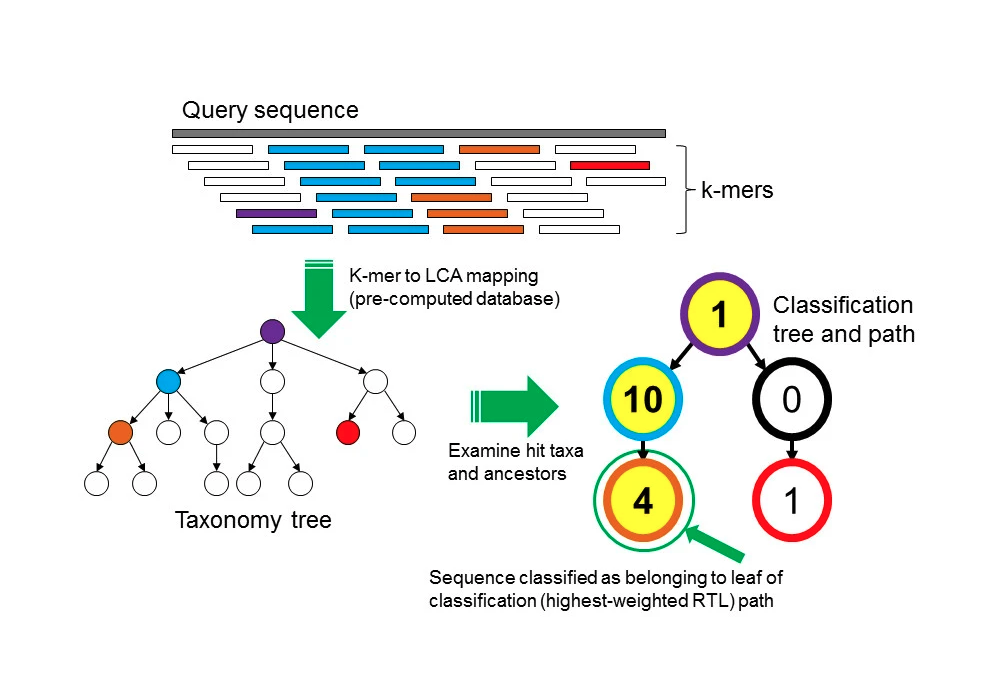  
**Figure 1**: The Kraken sequence classification algorithm. [original here](https://genomebiology.biomedcentral.com/articles/10.1186/gb-2014-15-3-r46/figures/1)

While this is already a well performing taxonomic profiling method, it suffers from one major drawback: it can not account for duplicated sequences. For example, when reporting the number of reads belonging to each taxon in a sample, Kraken is not able to distinguish an evenly covered genome (likely a true positive) from a genome suffering from read stacking (likely a false positive), often being the symptom (fig 2) of a false positive assignment, due to reads matching ultra-conserved regions between taxons from the same clade.

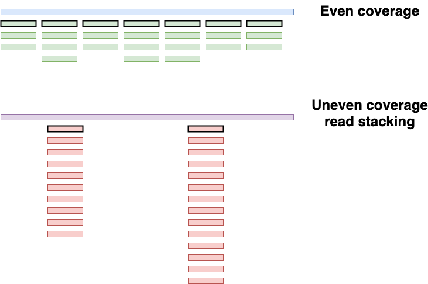  
**Figure 2**: Two taxons having the same amount of assigned reads, two different scenarios. The blue genome has an evenly distributed coverage, while the purple genome suffers from read stacking. Unique kmers are highlighted with a black perimeter

To circument this problem, KrakenUniq leverages the [HLL algorithm](https://en.wikipedia.org/wiki/HyperLogLog) to count the unique/distinc k-mers. In practice, in the example of fig 2, Kraken would have reported a "coverage" of 24 for both the blue and purple genome, while KrakenUniq would have reported a "coverage" of 7 for the blue genome, and 2 for the purple genome.

On top of that, KrakenUniq keeps track of how many of unique k-mers have been found, out all possible unique k-mers for each genome, which gives an estimation of the "coverage".

So, to summarize, with KrakenUniq, for each taxon, we now have three different metrics instead of "just one" for Kraken :

- read count per taxon (which we already had with kraken), we'll refer to it later as $R$
- number of unique k-mers (new with KrakenUniq), we'll refer to it later as $K$
- "coverage" coverage of the k-mers of the clade in the database, we'll refer to it later as $C$

Note that I've always mentioned the "coverage" between quotes, this is because [KrakenUniq defines it](https://github.com/fbreitwieser/krakenuniq/blob/2ac22bf7681223efa17ffba221231c7faac9da05/src/taxdb.hpp#L1103) as $C = \frac{k}{genome\ size}$.  
Because by definition, the maximum number of k-mers (of length $k$) for a sequence of length $L$ can not exceed $L - k + 1$. This means that in the ideal situation, for example the blue genome of fig 2, the "coverage" will be at best, close to 1, but never greater than 1.

To try to make sense of these three metrics, [Guellil et al. 2022](https://doi.org/10.1186/s13059-021-02580-z) came up with a score $E$ combining them, to discriminate true positive from false positive taxonomic assignments.

$$E = \frac{K}{R} \times C$$

Here, using different simulated taxon assignment situations, I propose a tweak to this score, to try to improve its ability to differentiate true positive from false positive taxonomic assignments.

## The simulations

First, let's define a few parameters for our simulation, and import necessary libraries

```python
import numpy as np
import matplotlib.pyplot as plt
import seaborn as sns
import pandas as pd

read_length = 45
kmer_length = 35
genome_size = 1000000
```

**We'll look at four different possible scenarios**  
For each scenario, we'll simulated 100 different situations

#### scenario A: high duplication, low coverage (false positive)

- A lot of reads are duplicated, probably coming from conversed regions, or sequencing artifacts
- low coverage
- There are more reads than unique kmers

```python
a_reads = np.random.randint(10, 300, 100) # randomly choose the number of reads, between 10 and 300
comp_kmer_a = lambda x: int(x / np.random.randint(2,10, 1))  # randomly choose between 2 and 10 times less k-mers
comp_kmer_a_vec = np.vectorize(comp_kmer_a)
a_kmers = comp_kmer_a_vec(a_reads)
plt.plot(a_kmers/a_reads, label=r"$\frac{k}{R}$")
plt.plot(a_kmers/genome_size, label="cov")
plt.title("scenario A")
plt.legend(loc="upper left");
```

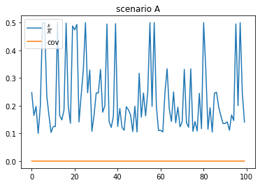

#### scenario B: low duplication, low coverage (true positive)

- Very few reads are duplicated
- low coverage
- more unique kmers than reads (up to $ku = read\_length - kmer\_length + 1$ more unique k-mers than reads)

```python
b_reads = np.random.randint(10, 300, 100) # randomly choose the number of reads, between 10 and 300
comp_kmer_b = lambda x: min(genome_size - kmer_length + 1, int(x * np.random.randint(2,(read_length - kmer_length + 1), 1))) # randomly choose up to ku more k-mers than reads
comp_kmer_b_vec = np.vectorize(comp_kmer_b)
b_kmers = comp_kmer_b_vec(b_reads)

plt.plot(b_kmers/b_reads, label=r"$\frac{k}{R}$")
plt.plot(b_kmers/genome_size, label="cov")
plt.title("scenario B")
plt.legend(loc="upper left");
```

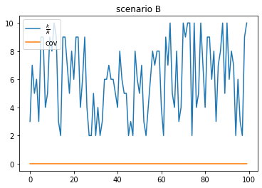

#### scenario C: low duplication, higher coverage (true positive)

- same as scenario B, but with a higher coverage

```python
c_reads = np.random.randint(10000, 100000, 100) # # randomly choose the number of reads, between 10000 and 100000
comp_kmer_c = lambda x: min(genome_size - kmer_length + 1, int(x * np.random.randint(2,(read_length - kmer_length + 1), 1)))
comp_kmer_c_vec = np.vectorize(comp_kmer_c)
c_kmers = comp_kmer_c_vec(c_reads)
plt.plot(c_kmers/c_reads, label=r"$\frac{k}{R}$")
plt.plot(c_kmers/genome_size, label="cov")
plt.title("scenario C")
plt.legend(loc="upper left");
```

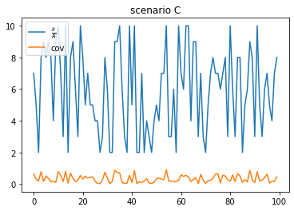

#### scenario D: low duplication, high coverage

- more reads than unique kmers (because of the coverage definiton of KrakenUniq)
- high coverage

```python
d_reads = np.random.randint(genome_size*1.1, genome_size*3, 100) # getting between 1.1*genome_size and 3*genome size reads
comp_kmer_d = lambda x: min(genome_size - kmer_length + 1, int(x * np.random.randint(2,(read_length - kmer_length + 1), 1)))
comp_kmer_d_vec = np.vectorize(comp_kmer_d)
d_kmers = comp_kmer_d_vec(d_reads)
plt.plot(d_kmers/d_reads, label=r"$\frac{k}{R}$")
plt.plot(d_kmers/genome_size, label="cov")
plt.title("scenario D")
plt.legend(loc="upper left");
```

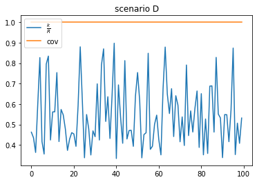

## Comparing E-scores

### Guellil *et al.* E-score

Now that we have our four different scenarios, let's look at how [Guellil *et al.*](https://doi.org/10.1186/s13059-021-02580-z) E-score performs at discriminating between true positive (scenario A) and false positive (scenario B, C, and D) taxonomic assignments.

```python
def e_score_guellil(nb_kmer, nb_read, genome_size):
    cov = nb_kmer/genome_size
    
    return((nb_kmer/nb_read) * cov )
e_score_guellil_vec = np.vectorize(e_score_guellil)
```

```python
e_score_guellil_a = e_score_guellil_vec(a_kmers, a_reads, genome_size)
e_score_guellil_b = e_score_guellil_vec(b_kmers, b_reads, genome_size)
e_score_guellil_c = e_score_guellil_vec(c_kmers, c_reads, genome_size)
e_score_guellil_d = e_score_guellil_vec(d_kmers, d_reads, genome_size)

plt.plot(e_score_guellil_a, label = "scenario A")
plt.plot(e_score_guellil_b, label = "scenario B")
plt.plot(e_score_guellil_c, label = "scenario C")
plt.plot(e_score_guellil_d, label = "scenario D")
plt.legend(loc="upper left")
plt.title("Guellil et al. E score")
plt.ylim(0,0.001);
```

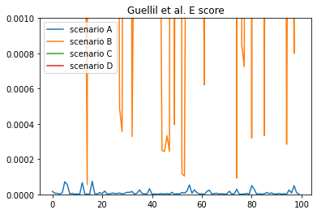

As we can see, it can be quite tricky in some situations to differentiate a true from a false positive assignment. This is particularly problematic beween scenario A and scenario B.

### Modified *dexp* E-score

Here I propose a slightly different score to mitigate some of issue.
Instead of defining

$$E = \frac{K}{R}\times C$$

I propose to use

$$E = \frac{K}{R} \times dexp(C)$$

with $dexp$ being the [double exponential function](https://en.wikipedia.org/wiki/Double_exponential_function).

This way, more emphasis is given to the "coverage", which particularly helps in low "coverage" scenarios, since the double exponential function grows "really fast" between 0 and 1.

```python
#https://en.wikipedia.org/wiki/Double_exponential_function
def double_exp(x, a=1.3, b=18):
    return(a**(b*x))
double_exp_vec = np.vectorize(double_exp) 
```

```python
x = np.arange(0,1,0.01)
y = double_exp_vec(x)
plt.plot(x, y)
plt.title("Double exponential function");
```

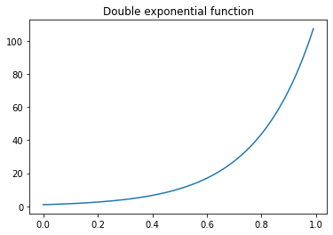

```python
def e_score_dexp(nb_kmer, nb_read, genome_size):
    cov = nb_kmer/genome_size
    
    return((nb_kmer/nb_read) * double_exp(cov))
e_score_dexp_vec = np.vectorize(e_score_dexp)
```

Now let's look at how this modified E-score performs

```python
e_score_dexp_a = e_score_dexp_vec(a_kmers, a_reads, genome_size)
e_score_dexp_b = e_score_dexp_vec(b_kmers, b_reads, genome_size)
e_score_dexp_c = e_score_dexp_vec(c_kmers, c_reads, genome_size)
e_score_dexp_d = e_score_dexp_vec(d_kmers, d_reads, genome_size)

plt.plot(e_score_dexp_a, label = "case_a")
plt.plot(e_score_dexp_b, label = "case_b")
plt.plot(e_score_dexp_c, label = "case_c")
plt.plot(e_score_dexp_d, label = "case_b")
plt.legend(loc="upper left")
plt.title("Double-exp E-score")

plt.ylim(0,4);
```

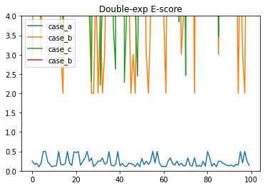

We can see that there is a much clearer distinction between true and false positive assignments.
We can also look at the mean difference of all scenarios between true and false positives, for the original, and the new double exp E-score

```python
diff_e_score_guellil = np.mean([e_score_guellil_b - e_score_guellil_a, e_score_guellil_c - e_score_guellil_a, e_score_guellil_d - e_score_guellil_a], axis=0)
diff_e_score_dexp = np.mean([e_score_dexp_b - e_score_dexp_a, e_score_dexp_c - e_score_dexp_a, e_score_dexp_d - e_score_dexp_a], axis=0)
```

```python
plt.plot(diff_e_score_guellil, label="Guellil et al. E-score")
plt.plot(diff_e_score_dexp, label="double-exp E-score")
plt.title("Diffence of E-score between true and false positive\n(the greater the better)")
plt.legend(loc="upper left")
plt.ylim(0,30);
```

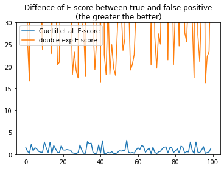

```python
df = pd.DataFrame(list(zip(diff_e_score_guellil, diff_e_score_dexp)), columns=['Guellil et al.', 'dexp'])
```

```python
sns.boxplot(data=df)
plt.title("Diffence of E-score between true and false positive\n(the greater the better)");
```

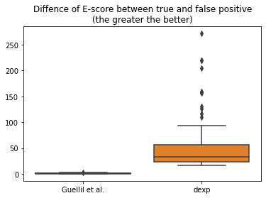

```python
df.mean(axis=0)
```

    Guellil et al.     1.012888
    dexp              50.104112
    dtype: float64

We can see that on average between all scenarios, for Guellil *et al.* E-score, there is only a difference of `1` points, while for the modified double-exponential E-score, there is an average difference of `50` points.

### Conclusion

In my simulations, using a the modified double-exponential E-score could allow for a better distinction between true and false positive taxonomic assignations by KrakenUniq

*The notebook used in this blog post is available* [*here*](<https://gist.github.com/49841c19b4f78c6182b6cce75e9025f2>)
