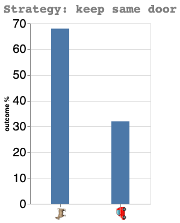
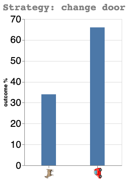

I've been recently reminded of the Monty Hall problem, and I thought I would try to show how to solve it with simulations in Python.

Inspired from the 60's American TV game show [Let's Make a Deal](https://en.wikipedia.org/wiki/Let%27s_Make_a_Deal), the principle is the following:
The player is faced with three doors, behind one of which is a big prize (a 🚗), and behind the two others, a 🐐, and has to choose one, without opening it yet.

After the participant chose a door, Monty Hall (the host of the show) opens one of the two other door, behind which is always a 🐐.  
*What is the best strategy to win the 🚗 ?*  
Keeping the original choice, or changing of door ?

It turns out that...  
Read further to find out 😉

```python
import numpy as np
import altair as alt
import pandas as pd
alt.renderers.enable('mimetype')
```

```python
nb_games = 10000 # The number of games we're going to simulate
```

```python
games = []
for i in range(nb_games):
    game = np.repeat('🐐', 3)
    prize = np.random.randint(0,3,1) # the door behind which the car is hidden
    game[prize]='🚗' 
    games.append(game)
    
```

### Strategy: keep door

```python
wins=0 # win counter
for i in range(nb_games):
    doors = [0,1,2]
    player_door_choice = int(np.random.choice(doors, 1)) # the player initial's door choice
    doors.remove(player_door_choice) # doors not chosen by player
    for j in doors: # Monty Hall reveals that behind one of the door not chosen is a goat
        if games[i][j] == '🐐':
            goat_door = j
    if games[i][player_door_choice] == '🚗': # The player keeps his initial door choice
        wins += 1

```

```python
print(f"Winning percentage: {round(wins/nb_games*100,1)}%")
```

    Winning percentage: 32.1%

```python
x = ['🚗','🐐']
y = [round(wins/nb_games*100, 0), 100 - round(wins/nb_games*100, 0)]
source = pd.DataFrame({'x':x, 'y':y})
(alt.Chart(source).mark_bar(size=30).encode(
    x=alt.X('x', axis=alt.Axis(title=None)),
    y=alt.Y('y', axis=alt.Axis(title='outcome %'))
).properties(width=200, title='Strategy: keep same door')
.configure_axis(labelFontSize=20)
.configure_title(
    fontSize=20,
    font='Courier',
    anchor='start',
    color='gray'
))
```



### Strategy: change door

```python
wins=0
for i in range(nb_games):
    doors = [0,1,2]
    player_door_choice = int(np.random.choice(doors, 1)) # the player initial's door choice
    doors.remove(player_door_choice) # doors not chosen
    for j in doors: # Monty Hall reveals that behind one of the door not chosen is a goat
        if games[i][j] == '🐐':
            goat_door = j
    doors.remove(goat_door) # the player changes its door choice
    if games[i][doors[0]] == '🚗':
        wins += 1
```

```python
print(f"Winning percentage: {round(wins/nb_games*100,1)}%")
```

    Winning percentage: 66.7%

```python
x = ['🚗','🐐']
y = [int(wins/nb_games*100), 100 - int(wins/nb_games*100)]
source = pd.DataFrame({'x':x, 'y':y})
(alt.Chart(source).mark_bar(size=30).encode(
    x=alt.X('x', axis=alt.Axis(title=None)),
    y=alt.Y('y', axis=alt.Axis(title='outcome %'))
).properties(width=200, title='Strategy: change door')
.configure_axis(labelFontSize=20)
.configure_title(
    fontSize=20,
    font='Courier',
    anchor='start',
    color='gray'
))
```



As I showed above, the **door changing strategy is much better** with a 66.6% change of winning, vs 33.3% if we keep the original door.

If you want to learn more about the Monty Hall problem, and how to prove using the Baye's theorem, have a reat at the [wikipedia page](https://en.wikipedia.org/wiki/Monty_Hall_problem)

Finally, the code behind this post is [here](https://gist.github.com/maxibor/9d896b69c999b2feca4f6375be779aac)

Last but not least, if you want to make it interactive with JavaScript P5, please have a look at this video from the Coding Train, which inspired this blog post 🙂

<html>
 <body>
  <iframe src="https://www.youtube.com/embed/0zac-cDzJwA"
   width="560" height="315" frameborder="0" allowfullscreen></iframe>
 </body>
</html>
